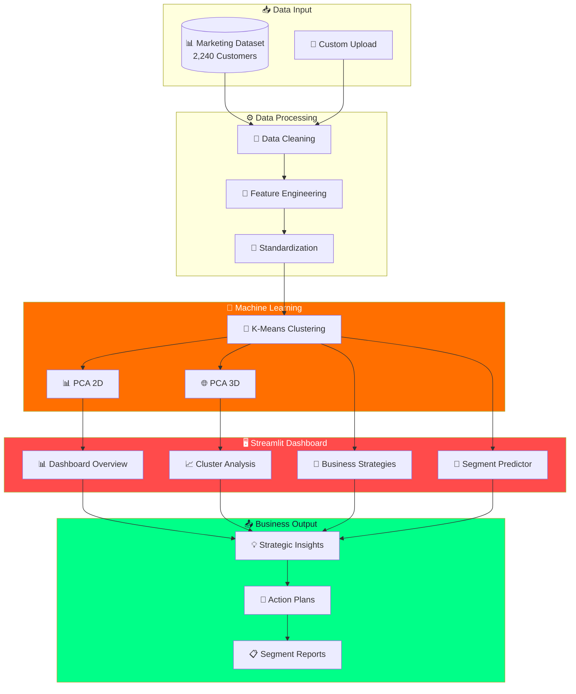
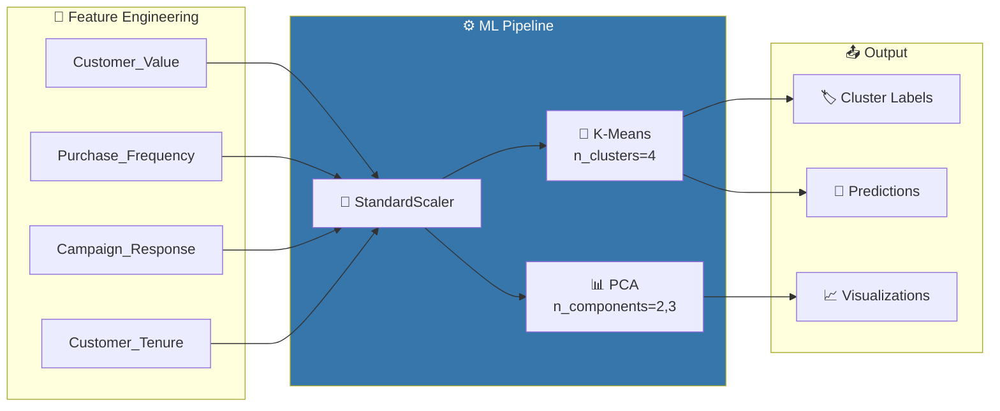
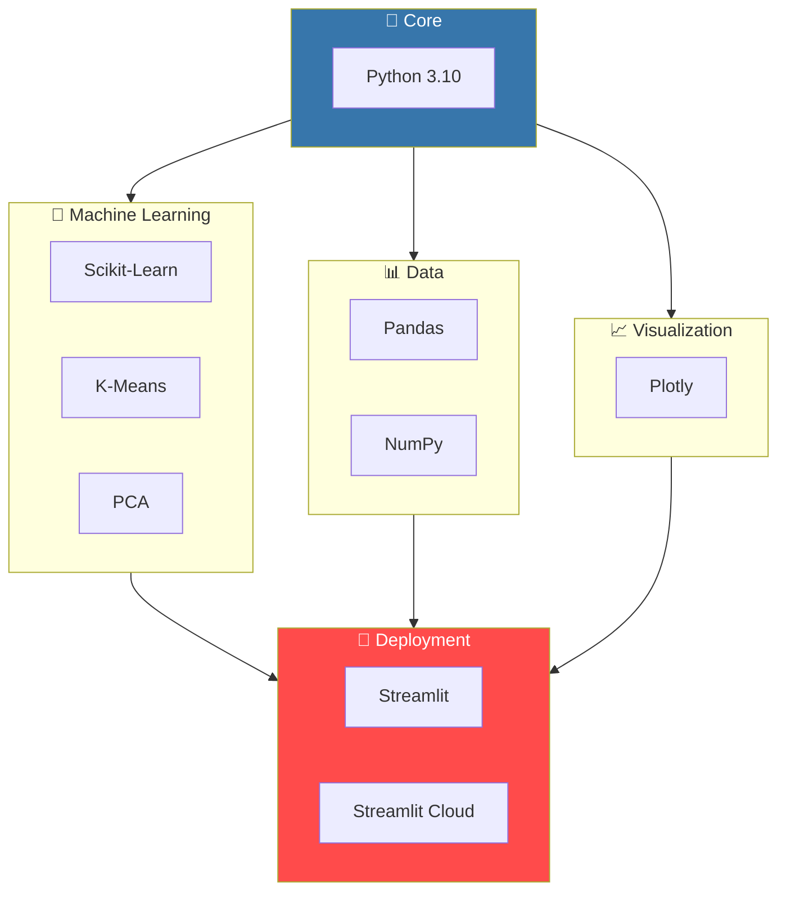

<p align="center">
  
</p>

<h3 align="center">
  🎯 Smart Segmentation | 🧠 ML-Driven Insights | 💼 Actionable Strategies | 🔮 Real-Time Predictions
</h3>

<p align="center">
  
  
  
  
  
</p>

<p align="center">
  
  
  
  
</p>

<p align="center">
  <a href="https://customer-segmentation-clustering-4.streamlit.app/">🚀 Live Demo</a> •
  <a href="#-features">Features</a> •
  <a href="#-installation">Installation</a> •
  <a href="#-customer-segments">Segments</a> •
  <a href="#-business-impact">Business Impact</a>
</p>

---

## 🎯 Live Demo

<p align="center">
  <a href="https://customer-segmentation-clustering-4.streamlit.app/" target="_blank">
    
  </a>
</p>

<p align="center">
  <a href="https://customer-segmentation-clustering-4.streamlit.app/">
    
  </a>
  
  
</p>

<table align="center">
  <tr>
    <td align="center">
      <h3>🔗 Application URL</h3>
      <a href="https://customer-segmentation-clustering-4.streamlit.app/">
        <code>https://customer-segmentation-clustering-4.streamlit.app/</code>
      </a>
    </td>
  </tr>
</table>

<details>
<summary><b>📸 Dashboard Preview (Click to Expand)</b></summary>
<br>

| 📊 Dashboard Overview | 📈 Cluster Analysis |
|:---:|:---:|
| KPI Cards, Segment Distribution | 3D Interactive Visualization |

| 💼 Business Strategies | 🔮 Segment Predictor |
|:---:|:---:|
| Actionable Recommendations | Real-Time Customer Classification |

</details>

---

## 📋 Table of Contents

- [Overview](#-overview)
- [Business Problem](#-business-problem)
- [Customer Segments](#-customer-segments)
- [System Architecture](#️-system-architecture)
- [Features](#-features)
- [ML Pipeline](#-ml-pipeline)
- [Installation](#-installation)
- [Usage](#-usage)
- [Tech Stack](#️-tech-stack)
- [Business Impact](#-business-impact)
- [Author](#-author)

---

## 🌟 Overview

**Customer Segmentation Dashboard** is an enterprise-grade machine learning application that leverages **K-Means clustering** to segment customers into actionable groups. Built with **Streamlit** and powered by **Plotly**, this dashboard transforms raw customer data into strategic marketing intelligence.

<table align="center">
  <tr>
    <td align="center">
      
      <br><b>AI-Powered</b>
      <br><sub>K-Means + PCA</sub>
    </td>
    <td align="center">
      
      <br><b>3D Visualization</b>
      <br><sub>Interactive Plotly</sub>
    </td>
    <td align="center">
      
      <br><b>Strategic Insights</b>
      <br><sub>Actionable Plans</sub>
    </td>
    <td align="center">
      
      <br><b>Real-Time Predict</b>
      <br><sub>Instant Results</sub>
    </td>
  </tr>
</table>

> 💡 **Key Value**: Transform customer data into targeted marketing campaigns with data-driven segment identification and personalized strategy recommendations.

---

## 💼 Business Problem

Understanding customers is crucial for business success. Generic marketing fails to resonate with diverse customer bases:

| Challenge | Impact | Solution |
|-----------|--------|----------|
| 🎭 **One-Size-Fits-All Marketing** | Low conversion rates | Segment-specific campaigns |
| 💸 **Wasted Marketing Budget** | Poor ROI on campaigns | Targeted resource allocation |
| 😐 **Customer Disengagement** | High churn rates | Personalized engagement |
| 📉 **Missed Revenue Opportunities** | Underserved VIPs | Priority-based strategies |

### 🎯 Project Objectives

```
┌─────────────────────────────────────────────────────────────────────┐
│  🎯 SEGMENT customers into distinct behavioral groups               │
│  📊 VISUALIZE clusters with 2D/3D interactive plots                 │
│  💡 GENERATE actionable marketing strategies per segment            │
│  🔮 PREDICT segment for new customers in real-time                  │
│  📈 MAXIMIZE marketing ROI through targeted approaches              │
└─────────────────────────────────────────────────────────────────────┘
```

---

## 🎨 Customer Segments

Our K-Means algorithm identifies **4 distinct customer segments**:

<table>
  <tr>
    <td align="center" width="25%">
      <h3>🟢 Highly Engaged</h3>
      
      <br><br>
      <b>Active Buyers</b>
      <br>High purchase frequency
      <br>Shop regularly
      <br>Low campaign response
      <hr>
      <i>Strategy: Loyalty rewards</i>
    </td>
    <td align="center" width="25%">
      <h3>🟣 High Risk</h3>
      
      <br><br>
      <b>At-Risk Customers</b>
      <br>Low purchase frequency
      <br>Infrequent engagement
      <br>Churn risk
      <hr>
      <i>Strategy: Win-back campaigns</i>
    </td>
    <td align="center" width="25%">
      <h3>🔵 VIP Premium</h3>
      
      <br><br>
      <b>Best Customers</b>
      <br>Highest value
      <br>Campaign responsive
      <br>Long-term loyal
      <hr>
      <i>Strategy: VIP treatment</i>
    </td>
    <td align="center" width="25%">
      <h3>🔴 Price-Sensitive</h3>
      
      <br><br>
      <b>Budget Shoppers</b>
      <br>Lowest value
      <br>Deal hunters
      <br>Price conscious
      <hr>
      <i>Strategy: Discount offers</i>
    </td>
  </tr>
</table>

### 📊 Segment Distribution

```
       Segment Distribution
       ════════════════════════════════════════
       🟢 Highly Engaged   ████████████████░░░░  40%
       🟣 High Risk        ████████░░░░░░░░░░░░  20%
       🔵 VIP Premium      ██████░░░░░░░░░░░░░░  15%
       🔴 Price-Sensitive  █████████░░░░░░░░░░░  25%
```

---

## 🏗️ System Architecture



---

## ✨ Features

### 📊 Dashboard Overview
<table>
  <tr>
    <td>✅ Real-time KPI cards with customer metrics</td>
    <td>✅ Interactive pie chart for segment distribution</td>
  </tr>
  <tr>
    <td>✅ Bar chart comparing cluster sizes</td>
    <td>✅ 2D PCA scatter plot visualization</td>
  </tr>
</table>

### 📈 Cluster Analysis
<table>
  <tr>
    <td>✅ **3D Interactive Visualization** - Rotate, zoom, explore clusters</td>
  </tr>
  <tr>
    <td>✅ **Detailed Statistics** - Average values per cluster per feature</td>
  </tr>
  <tr>
    <td>✅ **Expandable Insights** - Deep dive into each segment</td>
  </tr>
</table>

### 💼 Business Strategies
<table>
  <tr>
    <td>✅ Segment-specific marketing recommendations</td>
    <td>✅ Priority matrix for resource allocation</td>
  </tr>
  <tr>
    <td>✅ Expected ROI indicators per segment</td>
    <td>✅ Actionable strategy lists</td>
  </tr>
</table>

### 🔮 Segment Predictor
<table>
  <tr>
    <td>✅ Real-time customer classification</td>
    <td>✅ Input validation with sample values</td>
  </tr>
  <tr>
    <td>✅ Instant strategy recommendations</td>
    <td>✅ Visual segment cards with details</td>
  </tr>
</table>

---

## 🔬 ML Pipeline



### 📊 Feature Definitions

| Feature | Formula | Description |
|---------|---------|-------------|
| **Customer_Value** | Income + All Spending | Total monetary value of customer |
| **Purchase_Frequency** | Web + Catalog + Store + Deals | Total purchase count across channels |
| **Campaign_Response** | Sum of AcceptedCmp1-5 + Response | Marketing campaign engagement |
| **Customer_Tenure** | Days since Dt_Customer / 365 | Years as a customer |

---

## 💻 Installation

### Prerequisites

```bash
Python 3.10+
pip package manager
Git
```

### 🚀 Quick Start

```bash
# 1️⃣ Clone the repository
git clone https://github.com/shashankphenomeno111/customer-segmentation.git

# 2️⃣ Navigate to project directory
cd customer-segmentation

# 3️⃣ Create virtual environment
python -m venv venv

# 4️⃣ Activate virtual environment
# Windows:
venv\Scripts\activate
# Linux/Mac:
source venv/bin/activate

# 5️⃣ Install dependencies
pip install -r requirements.txt

# 6️⃣ Run the dashboard
streamlit run app.py
```

### 📦 Dependencies

```python
streamlit>=1.28.0    # Web framework
pandas>=2.0.0        # Data manipulation
numpy>=1.24.0        # Numerical computing
plotly>=5.17.0       # Interactive visualizations
scikit-learn>=1.3.0  # ML algorithms
joblib>=1.3.0        # Model persistence
```

---

## 🚀 Usage

### Running the Dashboard

```bash
streamlit run app.py
```

Access at: `http://localhost:8501`

### 📍 Navigation Guide

| Page | Purpose |
|------|---------|
| 📊 **Dashboard** | Overview with KPIs and segment distribution |
| 📈 **Cluster Analysis** | 3D visualization and detailed statistics |
| 💼 **Business Strategies** | Actionable recommendations per segment |
| 🔮 **Predict Segment** | Classify new customers in real-time |

### 🔮 Making Predictions

```
Step 1: Navigate to 🔮 Predict Segment
Step 2: Enter customer details:
        ├── 💰 Customer Value ($)
        ├── 🛒 Purchase Frequency
        ├── 📧 Campaign Response (0-6)
        └── 📅 Customer Tenure (years)
Step 3: Click "🔮 Predict Segment"
Step 4: View segment classification & strategies
```

---

## 🛠️ Tech Stack



---

## 📁 Project Structure

```
📦 customer-segmentation/
├── 📄 app.py                      # Main Streamlit dashboard
├── 📊 marketing_campaign.csv      # Customer dataset
├── 📋 requirements.txt            # Python dependencies
├── 📖 README.md                   # Documentation
└── 🧠 models/                     # Saved models (optional)
    ├── kmeans_model.joblib
    └── scaler.joblib
```

---

## 📈 Business Impact

### 💰 ROI Potential

<table align="center">
  <tr>
    <td align="center">
      <h3>📈 +35%</h3>
      <sub>Marketing Efficiency</sub>
    </td>
    <td align="center">
      <h3>💵 +25%</h3>
      <sub>Campaign ROI</sub>
    </td>
    <td align="center">
      <h3>🎯 +40%</h3>
      <sub>Targeting Accuracy</sub>
    </td>
    <td align="center">
      <h3>📉 -20%</h3>
      <sub>Customer Churn</sub>
    </td>
  </tr>
</table>

### 🎯 Strategic Applications

| Use Case | Segment | Strategy |
|----------|---------|----------|
| **VIP Retention** | 🔵 VIP Premium | Exclusive perks, early access |
| **Win-Back Campaigns** | 🟣 High Risk | "We miss you" emails, discounts |
| **Loyalty Programs** | 🟢 Highly Engaged | Points, rewards, referrals |
| **Value Optimization** | 🔴 Price-Sensitive | Bundle deals, flash sales |

---

## 🔮 Future Enhancements

- [ ] 🔗 **REST API** - Programmatic segment predictions
- [ ] 📊 **More Algorithms** - DBSCAN, Hierarchical clustering
- [ ] 📈 **Time-Series Analysis** - Customer lifecycle tracking
- [ ] 🤖 **Auto-ML** - Automated optimal cluster selection
- [ ] 📱 **Mobile App** - React Native dashboard
- [ ] 🔌 **CRM Integration** - Salesforce, HubSpot connectors

---

## 👤 Author

<h3 align="center">
  👋 Hi, I'm <b>Shashank R</b>
</h3>

<p align="center">
  <b>Data Scientist | Machine Learning Engineer | End-to-End Deployment Specialist</b>
</p>

<p align="center">
  
  
  
</p>

<p align="center">
  Passionate about building <b>real-world ML solutions</b> that transform data into business value.<br>
  Specialized in <b>clustering, classification, and end-to-end deployments</b>.
</p>

<br>

<p align="center">
  <a href="https://www.linkedin.com/in/shashankdatascientist/" target="_blank">
    
  </a>
  &nbsp;&nbsp;
  <a href="https://github.com/shashankphenomeno111" target="_blank">
    
  </a>
  &nbsp;&nbsp;
  <a href="https://www.kaggle.com/" target="_blank">
    
  </a>
</p>

---

<p align="center">
  
</p>

<p align="center">
  
</p>

<p align="center">
  
</p>

<p align="center">
  
</p>
